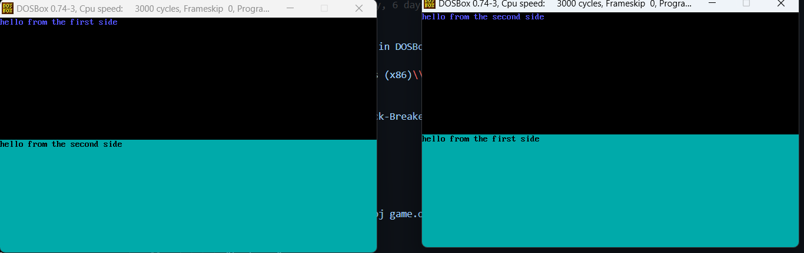

# 🎮 Brick Breaker Game (Multiplayer) - Assembly x86

## 🚀 Overview

Welcome to **Brick Breaker**, a dynamic and interactive multiplayer game written in Assembly x86. Break bricks, challenge your friends, and enjoy seamless gameplay through LAN or virtual ports. Whether you're playing solo or with friends, Brick Breaker delivers a classic gaming experience with a modern twist. 

> **Experience the thrill of retro gaming with cutting-edge multiplayer features!**

---

## ✨ Features

### 🎯 Main Board Options
- **Single Player Mode** ⚔️ - Test your skills against the bricks!
- **Multiplayer Mode** 🔬 - Compete with friends in real time.
- **Chat Feature** 🖬 - Stay connected with in-game messaging.
- **Exit** ❌ - End your session anytime.

### 🧩 Dynamic Gameplay
- Fully customizable **number and shape of bricks**.
- Tailored levels for endless variety, regardless of pre-defined arrays.

### 🔁 Try Again Page
- **Replay functionality**: Refine your strategy to beat your or your opponent's high score.

### 🌐 LAN or Virtual Port Support
- Play with friends locally or over virtual connections.

### 🚀 Progressive Difficulty
- **Challenge yourself**: Ball velocity increases after destroying a set number of bricks.

---

## 🎮 How to Play

1. **Choose Your Mode**
   - Navigate the main board to select between Single Player or Multiplayer modes.
2. **Control the Paddle**
   - Use your keyboard to move the paddle and direct the ball.
3. **Break the Bricks**
   - Destroy bricks to earn points and clear stages.
4. **Challenge Friends**
   - Use LAN or virtual ports for multiplayer excitement.
5. **Replay Your Strategy**
   - Lost the round? Head to the Try Again page to start fresh.

> **Tip:** Keep an eye on the increasing speed of the ball as you progress!

---

## 🛠️ Installation

1. Clone the repository:
   ```bash
   git clone <repository-url>
   ```

2. Launch the executable in your Assembly x86 environment:
   - Use **DOSBox** or any compatible emulator for smooth gameplay.

3. For multiplayer mode, please ensure you have the proper LAN or virtual port configuration.

---

## 📸 Screenshots
### Chatting: 💬🖼️


### Single Player: 🎮👤


### MultiPlayer: 🎮👫


### Try Again: 🔄🎯


### Main Board: 🏁🖥️


---

## 🤝 Contributors

| Contributor          | Role          | Social Links                                   |
|----------------------|---------------|-----------------------------------------------|
|  **Mohamed Abdelaziem Sayed** | Developer       | [GitHub](https://github.com/MohamedAbdelaiem) |
|  **Abdelrahaman Medhat** | Developer       | [GitHub](https://github.com/bedosaber77)      |
|  **Amr Hany**           | Developer       | [GitHub](https://github.com/Amrhanysayed)     |
|  **Mohamed Bahgat** | Developer       | [GitHub](https://github.com/MoBahgat010)      |


---

## 🧑‍💻 Technologies Used

- **Assembly x86**: Core programming language.
- **LAN and Virtual Ports**: Seamless multiplayer support.
- **DOSBox**: Emulator to run the game effectively.

---

## 🚀 Running the Assembly Code with DosBox and TASM/MASM

To run the assembly code for this project, follow these steps to set up your **DosBox** and **TASM/MASM** configuration in Visual Studio Code.

### 1. Install TASM/MASM Extension
First, install the **TASM/MASM** extension for Visual Studio Code to enable assembly code support.

1. Open **Visual Studio Code**.
2. Navigate to the **Extensions** tab (Ctrl+Shift+X).
3. Search for **TASM** or **MASM** and install the extension appropriate for your setup.

### 2. Install and Configure DosBox

Ensure that **DosBox** is installed on your system. You can download DosBox from [here](https://www.dosbox.com/).

- **DosBox URL**: The path where **DosBox** is installed on your system.
  
### 3. Project Files Setup

Make sure you have your **assembly project files** available in a directory.

- **Project Files URL**: The path to your project directory containing `.asm` files.

### 4. Create or Modify `tasks.json`

In your project, inside the `.vscode` folder, create or modify the `tasks.json` file to configure the task for running your assembly code.

Here's the sample configuration for `tasks.json`:

```json
{
  "version": "2.0.0",
  "tasks": [
    {
      "label": "Assemble with TASM in DOSBox",
      "type": "shell",
      "command": "C:\\Program Files (x86)\\DOSBox-0.74-3\\DOSBox.exe", // Path to DOSBox executable
      "args": [
        "-c",
        "mount C D:\\computer\\Brick-Breaker-x86-",  //path to to your project
        "-c",
        "C:",
        "-c",
        "TASM.EXE /m2 *.asm",
        "-c",

        "LINK.EXE  test.obj chat.obj game.obj MULT.obj tryagain.obj test.obj chat.obj game.obj MULT.obj",

        "-c",
        "test.exe"
      ],
      "group": {
        "kind": "build",
        "isDefault": true
      },
      "problemMatcher": []
    }
  ]
}

```

### 5. Running the Assembly Code
To run your assembly code, follow these steps:

1. Open **Visual Studio Code**.
2. Press **Ctrl+Shift+B** to run the build task.
3. **DosBox** will launch, mount your project directory, and run the **TASM** (or **MASM**) compiler on the `.asm` file.
4. After the code is compiled, **DosBox** will automatically close.

### 6. Troubleshooting
If you encounter issues:

- Double-check the paths in `tasks.json` for **DosBox** and your **project files**.
- Ensure **TASM** or **MASM** is correctly installed and working in your **DosBox** setup.


## 🌟 Future Enhancements

- **Power-ups**: Add features like extra balls or paddle extensions.
- **Leaderboard**: Show top scores to enhance competitiveness.
- **Levels**: Introduce new brick patterns and dynamic stages.

---

## 📜 License

This project is licensed under the **MIT License** - see the LICENSE file for details.

---

## 🏆 Acknowledgments

A heartfelt thanks to my collaborators and testers who made this project a success! 

---

## 🎉 Enjoy the Game

Get ready to break bricks, set records, and challenge your friends. Let the fun begin! ✨


